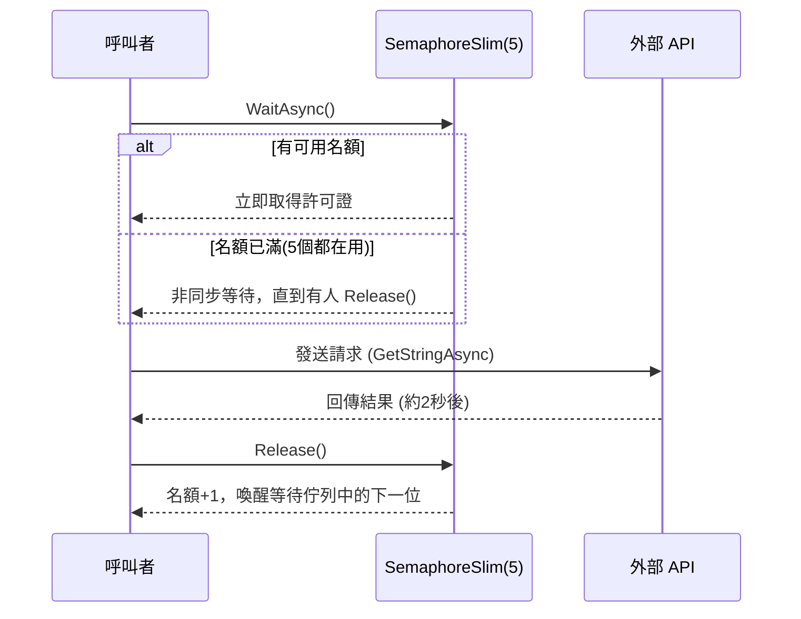

這段程式碼實作了一個**併發流量控制器（Rate Limiter）**，用來限制同時呼叫外部 API 的請求數量，避免對外部服務造成過大負載或觸發限流機制：
```C#
public class SharedResourceService
{
    // 設定最多只允許 5 個併發請求
    private readonly SemaphoreSlim _apiRateLimiter = new SemaphoreSlim(5, 5);
    private readonly HttpClient _httpClient = new HttpClient();

    public async Task<string> CallLimitedExternalApiAsync()
    {
        Console.WriteLine($"[{DateTime.UtcNow:O}] Waiting to enter the semaphore. Current count: {_apiRateLimiter.CurrentCount}");

        // 非同步等待號誌
        await _apiRateLimiter.WaitAsync();

        try
        {
            Console.WriteLine($"[{DateTime.UtcNow:O}] Entered the semaphore. Starting external API call...");
            // 模擬呼叫外部 API
            var result = await _httpClient.GetStringAsync("https://httpbin.org/delay/2");
            Console.WriteLine($"[{DateTime.UtcNow:O}] External API call finished.");
            return result;
        }
        finally
        {
            // 確保釋放號誌
            _apiRateLimiter.Release();
            Console.WriteLine($"[{DateTime.UtcNow:O}] Released the semaphore. Current count: {_apiRateLimiter.CurrentCount}");
        }
    }
}
```

## 核心元件

### 1. `SemaphoreSlim _apiRateLimiter = new SemaphoreSlim(5, 5)`

```csharp
private readonly SemaphoreSlim _apiRateLimiter = new SemaphoreSlim(5, 5);
```

- **`SemaphoreSlim`**：輕量級的號誌（semaphore），用於控制對某資源的併發存取數量。
- 建構子的兩個參數：
  - **第一個參數 `5`**：初始可用的「許可證（permit）」數量。
  - **第二個參數 `5`**：號誌允許的最大許可證數量。
- 意思是：**最多同時只能有 5 個執行緒/工作（Task）進入受保護的程式碼區塊**。

### 2. `HttpClient _httpClient`
用於實際發送 HTTP 請求呼叫外部 API（此例為 `https://httpbin.org/delay/2`，這是一個測試用端點，會延遲 2 秒才回應）。

## 方法邏輯：`CallLimitedExternalApiAsync()`

### 步驟拆解

```csharp
await _apiRateLimiter.WaitAsync();
```
- **非同步等待**取得一個許可證。
- 如果目前已有 5 個請求在執行（許可證用完），這個呼叫會**非同步阻塞（不佔用執行緒）**，直到有其他請求釋放許可證為止。
- 這是關鍵優勢：使用 `WaitAsync()` 而非同步的 `Wait()`，可以避免執行緒被鎖死，充分利用 async/await 的非阻塞特性。

```csharp
try
{
    var result = await _httpClient.GetStringAsync("https://httpbin.org/delay/2");
    return result;
}
finally
{
    _apiRateLimiter.Release();
}
```
- 進入 `try` 區塊後，實際呼叫外部 API 並等待回應。
- **無論成功或發生例外，`finally` 區塊都會執行 `Release()`**，將許可證歸還給號誌，讓其他等待中的請求可以進入。
- 這個 `try-finally` 模式是**確保資源釋放的標準寫法**，避免因例外而造成號誌「洩漏」（永久少一個名額）。

### `CurrentCount` 屬性
```csharp
_apiRateLimiter.CurrentCount
```
- 回傳**目前剩餘的許可證數量**（尚未被佔用的名額）。
- 僅用於日誌記錄，方便觀察併發狀態，**不建議用它來做流程判斷**，因為在多執行緒環境下這個數值可能在讀取當下就已經改變（存在 race condition）。

## 執行流程示意



## 為什麼要這樣設計？

| 目的 | 說明 |
|---|---|
| **限流保護** | 避免同時發出過多請求導致外部 API 被限流（rate limit）或伺服器過載 |
| **資源保護** | 若外部 API 有連線數上限，可避免超過限制 |
| **非阻塞等待** | 使用 `WaitAsync()` 而非 `Wait()`，不會佔用執行緒池的執行緒，適合高併發的 Web API 或伺服器情境 |
| **例外安全** | `try-finally` 確保即使呼叫失敗，許可證依然會被釋放，不會造成死鎖 |

## 潛在注意事項

1. **`HttpClient` 生命週期**：範例中將 `HttpClient` 設為 class 的欄位（單一實例、重複使用），這是正確做法，避免了頻繁建立 `HttpClient` 導致的 Socket 耗盡問題（Socket Exhaustion）。

2. **沒有 timeout / cancellation**：`WaitAsync()` 沒有帶入 `CancellationToken`，如果外部 API 一直不釋放，呼叫者可能會無限期等待。實務上建議加上：
   ```csharp
   await _apiRateLimiter.WaitAsync(cancellationToken);
   // 或設定逾時
   await _apiRateLimiter.WaitAsync(TimeSpan.FromSeconds(10));
   ```

3. **這是「單一程序內」的限制**：`SemaphoreSlim` 只能限制**同一個應用程式行程（process）內**的併發數，若應用程式是多執行個體部署（例如多台伺服器或多個 container），則無法達到全域限流效果，需要搭配分散式鎖（如 Redis）才能做到跨機器限流。

---

**簡單總結**：這段程式碼透過 `SemaphoreSlim(5, 5)` 建立一個「最多 5 張門票」的機制，任何要呼叫外部 API 的請求都得先拿到門票才能進行，用完後歸還門票，藉此達到**限制同時併發請求數量為 5**的效果，是很典型的 API 限流（Throttling）實作模式。